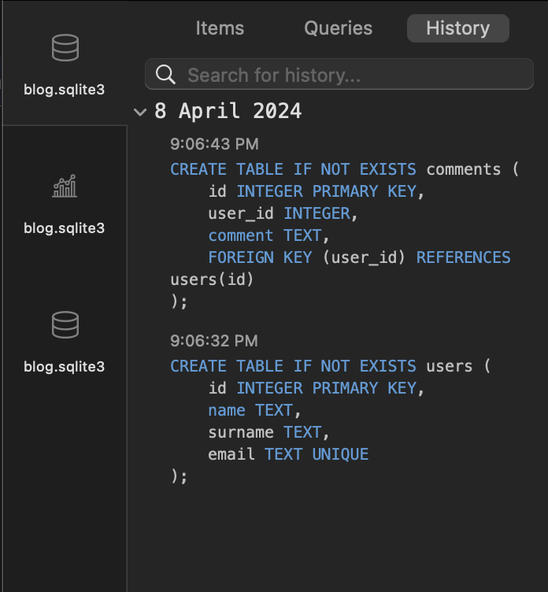
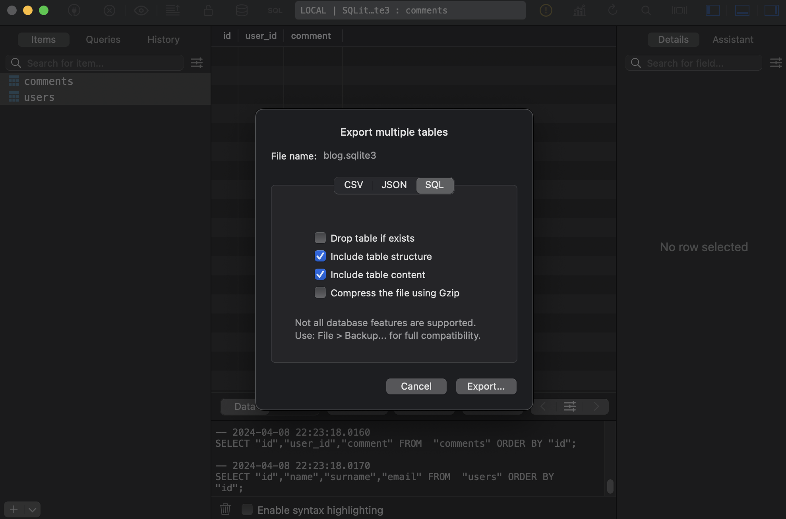

# Лабораторная работа №9

### Задание 1. Выберите базу данных, с которой вы планируете работать.  
Я выбрал: [1] sqlite — хороший выбор для небольших проектов или приложений, 
требующих легкого внедрения и простоты использования. SQLite представляет собой встроенную, автономную базу данных, которая не требует отдельного сервера.

### Задание 2. Создайте базу данных blog и создайте две базы данных users и comments с помощью языка DDL (CREATE TABLE)

```sql
CREATE TABLE IF NOT EXISTS users (
    id INTEGER PRIMARY KEY,
    name TEXT,
    surname TEXT,
    email TEXT UNIQUE
);

CREATE TABLE IF NOT EXISTS comments (
    id INTEGER PRIMARY KEY,
    user_id INTEGER,
    comment TEXT,
    FOREIGN KEY (user_id) REFERENCES users(id)
);

```



### Задание 3. Экспортируйте базу данных в файл .sql.




### Задание 5. В readme.md опишите структуру базу данных.

Таблица users:  
id: Уникальный идентификатор пользователя (INTEGER), используется как первичный ключ.  
name: Имя пользователя (TEXT).  
surname: Фамилия пользователя (TEXT).  
email: Адрес электронной почты пользователя (TEXT), уникальный ключ, что гарантирует, что каждый адрес электронной почты в таблице будет уникальным.  

Таблица comments:  
id: Уникальный идентификатор комментария (INTEGER), используется как первичный ключ.  
user_id: Идентификатор пользователя, к которому относится комментарий (INTEGER), внешний ключ, ссылается на столбец id в таблице users.  
comment: Текст комментария (TEXT).  

С помощью этой базы данных можно хранить информацию о пользователях и комментариях, связанных с ними. Каждый пользователь имеет уникальный идентификатор, и его имя, фамилия и адрес электронной почты хранятся в таблице users. Комментарии, оставленные пользователями, хранятся в таблице comments и связываются с соответствующим пользователем через столбец user_id.